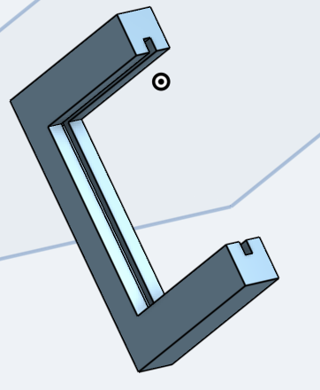
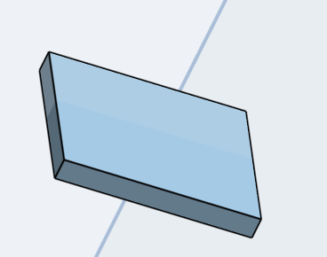
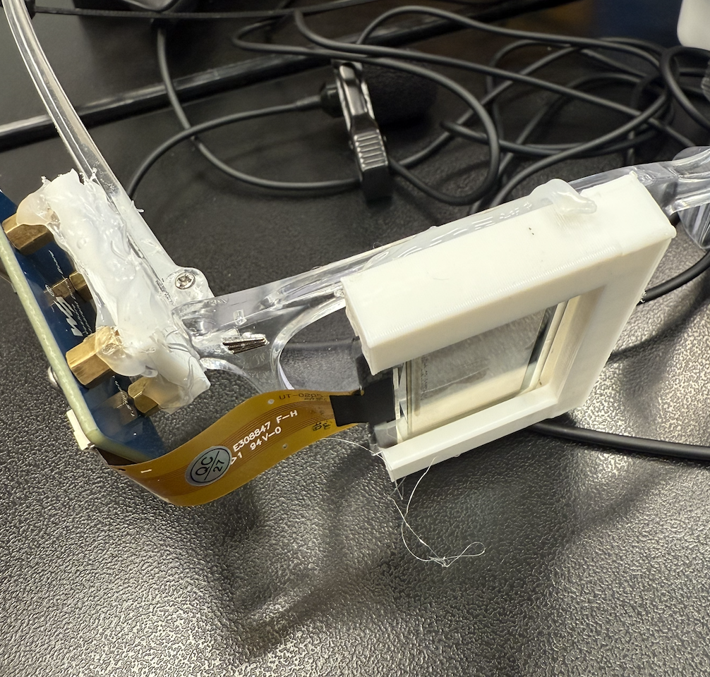
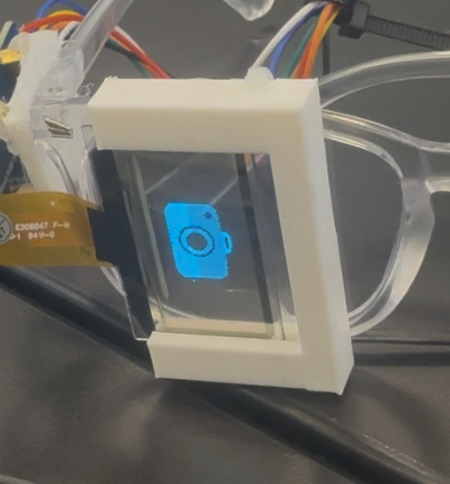
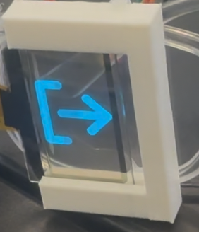
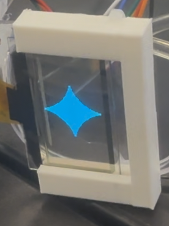
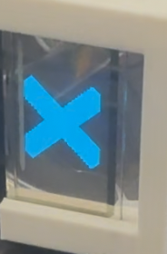
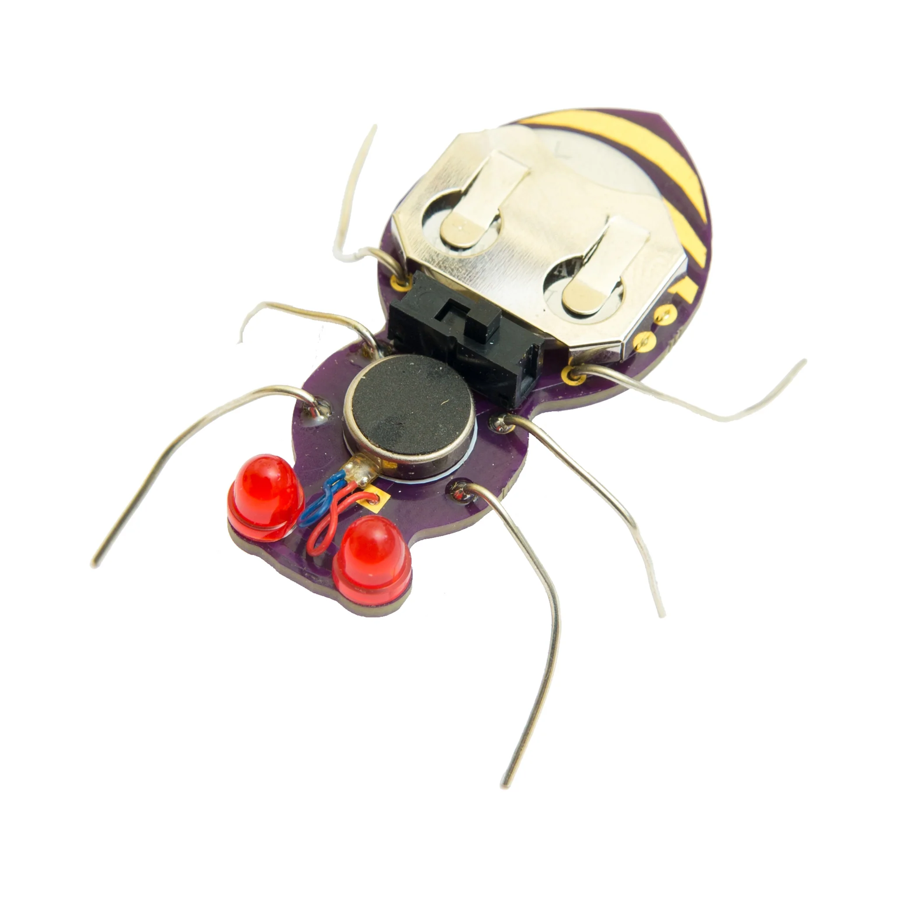

# Smart Glasses
My smart glasses use gemini, google cloud, vosk, pyaudio, google drive, and an OLED screen.  I input a voice command, pyaudio picks it up, vosk recognizes the audio and converts in into a command.  Using voice commands, I either take a picture, send a picture to gemini, upload a photo to google drive, or terminate the program.  The OLED screen displays something related to this.

| **Engineer** | **School** | **Area of Interest** | **Grade** |
|:--:|:--:|:--:|:--:|
| Jason P | Stratford Preparatory Blackford | Health | Incoming Sophomore |


# Modification

<iframe width="560" height="315" src="https://www.youtube.com/embed/TEhWn7Jzqlw?si=HhWe7D3EGORuOaLb" title="YouTube video player" frameborder="0" allow="accelerometer; autoplay; clipboard-write; encrypted-media; gyroscope; picture-in-picture; web-share" referrerpolicy="strict-origin-when-cross-origin" allowfullscreen></iframe>

For my  modification, I wanted to integrate Gemini so it could recognize plant dieases from an image, combined with having an OLED screen displaying these commands.  I also wanted to pair Gemini's response with TTS.  It would speak Gemini's response so the user wouldn't have to look in the terminal.  The biggest challenge happened when the TTS was not working.  It turns out it was trying to use a voice that wasn't supported but I installed espeak-ng and finally got the TTS to work.  Another problem I faced happened when the TTS was not coming out the headphone jack even though I had it plugged in.  This was a simple fix in the Pi settings.  I then used pyaudio voice recognition for hands free image capturing and image sending, so it would be more convient.  Most of the code stays the same, it still is able to capture an image and upload it.  However, now there is a while loop constantly running and picking up audio from my mic.  If it detects a keyword, such as "terminate," "send," or "upload," the respective commands will happen.  "Terminate" stops the program.  "Send" send the most recent "file.png" to gemini.  "Upload" takes a picture, overwrites "file.png," and sends it to google drive.  I also added an OLED screen so other people could see the functions I was performing.  When I send the picture to gemini, the OLED displays a gemini icon.  When I send the picture to google, it shows an upload icon.  Finally, when it terminates, it displays an "x" icon.  I got images of the icons, converted it to .bmp and made it fit on the screen, then made the OLED screen draw the bmp. I wanted to put this on my glasses, so I had to consider both the OLED module and the screen itself.  I first 3D printed a small square, and put screws and bolts on the module, as it already had holes.  I hotglued these bolts onto the square, and then I hotglued everything onto the side of the glasses.  For the screen, I 3d printed a little holder it could slide into.  Some problems I ran into concerning the OLED was that it would randomly glitch out and stop displaying stuff.  At first, I thought that the problem was a loose ribbon.  But in reality, it was faulty wiring.  I fixed it by hotgluing the wires together and tested the connection with a multimeter.

Fig.1



Fig1. This is the 3D print for the OLED holder.

Fig.2


Fig.2 This is the 3D print for the module connector.  I attached some bolts to the OLED module and hotglued those bolts to this, and this square the side of my glasses.



This is what they look like on my glasses.


This is the icon for "take a picture."


This is the icon for "upload to google drive."


This is the icon for "send to gemini."


This is the icon for "terminate."


# Code
```c++
from googleapiclient.discovery import build
from googleapiclient.errors import HttpError
from googleapiclient.http import MediaFileUpload

import os.path
import os
from google.auth.transport.requests import Request
from google.oauth2.credentials import Credentials
from google_auth_oauthlib.flow import InstalledAppFlow

from picamera2 import Picamera2, Preview
import time
import cv2

import vosk
import pyaudio
import json

import pyaudio


import google.generativeai as genai
import subprocess
import sys
import shlex

picdir = os.path.join(os.path.dirname(os.path.dirname(os.path.realpath(__file__))), 'pic')
libdir = os.path.join(os.path.dirname(os.path.dirname(os.path.realpath(__file__))), 'lib')
if os.path.exists(libdir):
    sys.path.append(libdir)

from waveshare_OLED import OLED_1in51
from PIL import Image
disp = OLED_1in51.OLED_1in51()
disp.Init()
disp.clear()
genai.configure(api_key="...")  

picam2 = Picamera2()
camera_config = picam2.create_still_configuration(main={"size": (1920, 1080)},
lores={"size": (640, 480)}, display="lores")
picam2.configure(camera_config)
#picam2.start_preview(Preview.QTGL) #Comment this out if not using desktop interface
picam2.start()


model = vosk.Model("/home/jasonpark/models/vosk-model-small-en-us-0.15")
rec = vosk.KaldiRecognizer(model, 16000, '["terminate", "upload", "send", "exit"]')

p = pyaudio.PyAudio()
stream = p.open(format=pyaudio.paInt16,
                channels=1,
                rate=16000,
                input=True,
                frames_per_buffer=8192)

SCOPES = ['https://www.googleapis.com/auth/drive']

  
"""Shows basic usage of the Drive v3 API.
Prints the names and ids of the first 10 files the user has access to.
"""
creds = None
# The file token.json stores the user's access and refresh tokens, and is
# created automatically when the authorization flow completes for the first
# time.
if os.path.exists("token.json"):
    creds = Credentials.from_authorized_user_file("token.json", SCOPES)
# If there are no (valid) credentials available, let the user log in.
if not creds or not creds.valid:
    if creds and creds.expired and creds.refresh_token:
        creds.refresh(Request())
    else:
        flow = InstalledAppFlow.from_client_secrets_file(
            "/home/jasonpark/credentials.json", SCOPES,
                redirect_uri='urn:ietf:wg:oauth:2.0:oob'

        )
        auth_url, _ = flow.authorization_url(prompt='consent')

        print(f'Please go to this URL: {auth_url}')

        code = input('Enter the authorization code: ')

        flow.fetch_token(code=code)
        creds = flow.credentials
    # Save the credentials for the next run
    with open("token.json", "w") as token:
        token.write(creds.to_json())


print("Listening for speech. Say 'Terminate' to stop.")
# Start streaming and recognize speech
while True:
    data = stream.read(4096)#read in chunks of 4096 bytes
    if rec.AcceptWaveform(data):#accept waveform of input voice
        # Parse the JSON result and get the recognized text
        result = json.loads(rec.Result())
        recognized_text = result['text']
        print(f"Recognized: {recognized_text}")

        # Check for the termination keyword
        if "terminate" in recognized_text.lower():
            print("Termination keyword detected. Stopping...")
            Himage2 = Image.new('1', (disp.width, disp.height), 255)  # 255: clear the frame
            bmp = Image.open(os.path.join(picdir, '/home/jasonpark/converted2.bmp'))
            Himage2.paste(bmp, (0,0))
            Himage2=Himage2.rotate(180) 	
            disp.ShowImage(disp.getbuffer(Himage2)) 
            time.sleep(3)
            disp.clear()
            break

        if "send" in recognized_text.lower():
            print("send keyword detected. sending to gemini...")
            Himage2 = Image.new('1', (disp.width, disp.height), 255)  # 255: clear the frame
            bmp = Image.open(os.path.join(picdir, '/home/jasonpark/converted1.bmp'))
            Himage2.paste(bmp, (0,0))
            Himage2=Himage2.rotate(180) 	
            disp.ShowImage(disp.getbuffer(Himage2)) 
            img = Image.open("file.png")  # Ensure the image exists

            # Set up Gemini Vision model
            model = genai.GenerativeModel("gemini-2.5-flash")

            # Send image with a prompt
            response = model.generate_content(
                [
                    "Describe the content of this image in 2-3 sentences.",
                    img
                ]
            )
            gemini_text = response.text
            print(gemini_text)
            
            os.system(f"espeak {shlex.quote(gemini_text)}")

            disp.clear() # Use espeak to read the response aloud
            # Load image from Raspberry Pi

        if "upload" in recognized_text.lower():
            Himage2 = Image.new('1', (disp.width, disp.height), 255)  # 255: clear the frame
            bmp = Image.open(os.path.join(picdir, '/home/jasonpark/converted.bmp'))
            Himage2.paste(bmp, (0,0))
            Himage2=Himage2.rotate(180) 	
            disp.ShowImage(disp.getbuffer(Himage2)) 
            im = picam2.capture_array()
            im = cv2.cvtColor(im, cv2.COLOR_BGR2RGB)
            cv2.imwrite('file.png', im)
            print("upload keyword detected. uploading...")
            try:
                # create drive api client
                service = build("drive", "v3", credentials=creds)
                folder_id = "1vx-evFr1qBKo6yGuxheW8QfZfdWrDmRz"
                file_metadata = {"name": "file.png"
                                , "parents": [folder_id]}

                media = MediaFileUpload("file.png", mimetype="image/png")
                # pylint: disable=maybe-no-member
                file = (
                    service.files()
                    .create(body=file_metadata, media_body=media, fields="id")
                    .execute()
                )
                print(f'File ID: {file.get("id")}')

            except HttpError as error:
                print(f"An error occurred: {error}")
                file = None
            print("Upload complete.")
            os.system(f"espeak 'Upload complete.'") 
            disp.clear()

stream.stop_stream()
stream.close()

# Terminate the PyAudio object
p.terminate()


# If modifying these scopes, delete the file token.json.
```
# Final Milestone
<iframe width="560" height="315" src="https://www.youtube.com/embed/NZ_2Al3L7MA?si=PVjcaJ8wZCsASP4x" title="YouTube video player" frameborder="0" allow="accelerometer; autoplay; clipboard-write; encrypted-media; gyroscope; picture-in-picture; web-share" referrerpolicy="strict-origin-when-cross-origin" allowfullscreen></iframe>

For my final milestone, after hot gluing my camera to my glasses, I used google cloud to send pictures from my raspberry pi to my google drive folder. I first had to download google auth and get google cloud, make an OAuth client, and connect it.  Then, I had to authorize it so it could access my google drive.  I ran into a lot of problems, such as not being able to log in because "the client didn't support javascript."  However, I fixed it by making sure my credentials were properly made.  When I logged in, the raspberry Pi got access.  It was able to upload a file in the raspberry pi.  After, I made it take a picture with the Picam and send that photo to my drive folder called "raspberry pi stuff."  I wanted to be able to store pictures so that the user could later look at them if they needed it.

# Code
```python
from googleapiclient.discovery import build
from googleapiclient.errors import HttpError
from googleapiclient.http import MediaFileUpload

import os.path

from google.auth.transport.requests import Request
from google.oauth2.credentials import Credentials
from google_auth_oauthlib.flow import InstalledAppFlow

from picamera2 import Picamera2, Preview
import time
import cv2


picam2 = Picamera2()
camera_config = picam2.create_still_configuration(main={"size": (1920, 1080)},
lores={"size": (640, 480)}, display="lores")
picam2.configure(camera_config)
#picam2.start_preview(Preview.QTGL) #Comment this out if not using desktop interface
picam2.start()
time.sleep(2)
im = picam2.capture_array()
im = cv2.cvtColor(im, cv2.COLOR_BGR2RGB)
cv2.imwrite('file.png', im)

# If modifying these scopes, delete the file token.json.
SCOPES = ['https://www.googleapis.com/auth/drive']
def upload_basic():
  
    """Shows basic usage of the Drive v3 API.
  Prints the names and ids of the first 10 files the user has access to.
  """
    creds = None
  # The file token.json stores the user's access and refresh tokens, and is
  # created automatically when the authorization flow completes for the first
  # time.
    if os.path.exists("token.json"):
        creds = Credentials.from_authorized_user_file("token.json", SCOPES)
    # If there are no (valid) credentials available, let the user log in.
    if not creds or not creds.valid:
        if creds and creds.expired and creds.refresh_token:
            creds.refresh(Request())
        else:
            flow = InstalledAppFlow.from_client_secrets_file(
                "credentials.json", SCOPES
            )
        creds = flow.run_local_server(port=0)
        # Save the credentials for the next run
        with open("token.json", "w") as token:
            token.write(creds.to_json())
    """Insert new file.
    Returns : Id's of the file uploaded

    Load pre-authorized user credentials from the environment.
    TODO(developer) - See https://developers.google.com/identity
    for guides on implementing OAuth2 for the application.
    """

    try:
        # create drive api client
        service = build("drive", "v3", credentials=creds)
        folder_id = "1vx-evFr1qBKo6yGuxheW8QfZfdWrDmRz"
        file_metadata = {"name": "file.png"
                          , "parents": [folder_id]}

        media = MediaFileUpload("file.png", mimetype="image/png")
        # pylint: disable=maybe-no-member
        file = (
            service.files()
            .create(body=file_metadata, media_body=media, fields="id")
            .execute()
        )
        print(f'File ID: {file.get("id")}')

    except HttpError as error:
        print(f"An error occurred: {error}")
        file = None

    return file.get("id")


if __name__ == "__main__":
  upload_basic()
```
This is my code for taking a photo and uploading it to my google drive.  First, I am importing core modules needed to authenticate with google cloud and upload files to google drive.  Then, I am importing modules related	to the Picam, which helps take pictures.  Next, the Picam takes a picture and writes in the "file.png" file.  Then, I am declaring my scope.  I set it to "allow all access to drive" so it could upload files and overcome permission errors.  Since I already made my token and authorized it, the code then checks the token.json first, for user access.  It only checks credentials if the token isn't there or it's invalid.  I set it to go to one of the folders in my google drive.
# Second Milestone

<iframe width="560" height="315" src="https://www.youtube.com/embed/KwafafNAArw?si=tgGg_9rC-52swaLf" title="YouTube video player" frameborder="0" allow="accelerometer; autoplay; clipboard-write; encrypted-media; gyroscope; picture-in-picture; web-share" referrerpolicy="strict-origin-when-cross-origin" allowfullscreen></iframe>

This is the second milestone of my project, where I performed basic object recognition using the Picam. I transitioned from openCV to tensorFlow so I could do object recognition.  The frame rate is low (because it's just constantly taking pictures, not an actual video) but the detection is decent.  I had to input a lot of downloading commands to get this to work.  Last milestone, I couldn't see exactly what the camera was seeing, but now I can see everything the camera is seeing thanks to tensorFlow.  There is a screen that pops up in the terminal that shows what the camera is seeing, frame by frame.  The camera is able to detect computer keyboards, mice, and other basic items.  The model says the object it detects out loud. This was a stepping stone for better recognition.  I kept running into errors in downloading tensorFlow, but i fixed it by running the commands line-by-line (i just copied and pasted a block of commands before this).
# Code

```python
 while not capture_manager.stopped:
        if capture_manager.frame is None:
            continue
        buffer.fill((0,0,0))
        frame = capture_manager.read()
        # get the raw data frame & swap red & blue channels
        previewframe = np.ascontiguousarray(capture_manager.frame)
        # make it an image
        img = pygame.image.frombuffer(previewframe, capture_manager.resolution, 'RGB')
        img = pygame.transform.scale(img, scaled_resolution)

        cropped_region = (
            (img.get_width() - buffer.get_width()) // 2,
            (img.get_height() - buffer.get_height()) // 2,
            buffer.get_width(),
            buffer.get_height()
        )

        # draw it!
        buffer.blit(img, (0, 0), cropped_region)

        timestamp = time.monotonic()
        if args.tflite:
            prediction = model.tflite_predict(frame)[0]
        else:
            prediction = model.predict(frame)[0]
        logging.info(prediction)
        delta = time.monotonic() - timestamp
        logging.info("%s inference took %d ms, %0.1f FPS" % ("TFLite" if args.tflite else "TF", delta * 1000, 1 / delta))
        print(last_seen)

        # add FPS & temp on top corner of image
        fpstext = "%0.1f FPS" % (1/delta,)
        fpstext_surface = smallfont.render(fpstext, True, (255, 0, 0))
        fpstext_position = (buffer.get_width()-10, 10) # near the top right corner
        buffer.blit(fpstext_surface, fpstext_surface.get_rect(topright=fpstext_position))
        try:
            temp = int(open("/sys/class/thermal/thermal_zone0/temp").read()) / 1000
            temptext = "%d\N{DEGREE SIGN}C" % temp
            temptext_surface = smallfont.render(temptext, True, (255, 0, 0))
            temptext_position = (buffer.get_width()-10, 30) # near the top right corner
            buffer.blit(temptext_surface, temptext_surface.get_rect(topright=temptext_position))
        except OSError:
            pass

        for p in prediction:
            label, name, conf = p
            if conf > CONFIDENCE_THRESHOLD:
                print("Detected", name)

                persistant_obj = False  # assume the object is not persistant
                last_seen.append(name)
                last_seen.pop(0)

                inferred_times = last_seen.count(name)
                if inferred_times / len(last_seen) > PERSISTANCE_THRESHOLD:  # over quarter time
                    persistant_obj = True

                detecttext = name.replace("_", " ")
                detecttextfont = None
                for f in (bigfont, medfont, smallfont):
                    detectsize = f.size(detecttext)
                    if detectsize[0] < screen.get_width(): # it'll fit!
                        detecttextfont = f
                        break
                else:
                    detecttextfont = smallfont # well, we'll do our best
                detecttext_color = (0, 255, 0) if persistant_obj else (255, 255, 255)
                detecttext_surface = detecttextfont.render(detecttext, True, detecttext_color)
                detecttext_position = (buffer.get_width()//2,
                                       buffer.get_height() - detecttextfont.size(detecttext)[1])
                buffer.blit(detecttext_surface, detecttext_surface.get_rect(center=detecttext_position))

                if persistant_obj and last_spoken != detecttext:
                    subprocess.call(f"echo {detecttext} | festival --tts &", shell=True)
                    last_spoken = detecttext
                break
        else:
            last_seen.append(None)
            last_seen.pop(0)
            if last_seen.count(None) == len(last_seen):
                last_spoken = None

        screen.blit(pygame.transform.rotate(buffer, args.rotation), (0,0))
        pygame.display.update()

if __name__ == "__main__":
    args = parse_args()
    try:
        main(args)
    except KeyboardInterrupt:
        capture_manager.stop()

```
This code keeps checking for objects is recognizes until it is forcefully stopped by the keyboard command "control C"(assuming no errors with piCam, system, etc.)  If it's confidence is over 50%, it will say the name of the object it thinks it saw on the screen.
# First Milestone

<iframe width="560" height="315" src="https://www.youtube.com/embed/eIhywB4pccY?si=DQWUQpK5KKYoSYFi" title="YouTube video player" frameborder="0" allow="accelerometer; autoplay; clipboard-write; encrypted-media; gyroscope; picture-in-picture; web-share" referrerpolicy="strict-origin-when-cross-origin" allowfullscreen></iframe>

This is the first milestone for my smart glasses project, which is setting up the raspberry pi.  This was not much of a challenge but it took a long time to download all the apps I needed for the raspberry pi and downloading the software for the pi.  I first had to get OBS, but I couldn't control the Pi on my computer yet.  I had to plug in a keyboard and mouse into the Pi so I could see what was happening on my computer screen.  I needed a direct connection so I could enable the ssh and then got tigerVNC, where I could control the Pi directly on my computer, and then setting up an SSH with VS code so I could code in python and run that code on the Pi.  All waiting aside, now it works well.  I can only take one picture at a time using openCV, but this the first step at using the camera.  Now that I know the Picam works properly, I can continue to improve on it.

# Code

```python
from picamera2 import Picamera2, Preview
import time
import cv2
picam2 = Picamera2()
camera_config = picam2.create_still_configuration(main={"size": (1920, 1080)},
lores={"size": (640, 480)}, display="lores")
picam2.configure(camera_config)
#picam2.start_preview(Preview.QTGL) #Comment this out if not using desktop interface
picam2.start()
time.sleep(2)
im = picam2.capture_array()
im = cv2.cvtColor(im, cv2.COLOR_BGR2RGB)
cv2.imwrite('file.png', im)

```
What happens here is that the piCam is getting set up, and openCV takes a picture, and it's designated to go to a file named "file.png".  It will overwrite file.png if it already exists.

# Starter Project : Jitterbug

<iframe width="560" height="315" src="https://www.youtube.com/embed/7qXCmAjE5eM?si=l6Hw6ky5PzJQHeuj" title="YouTube video player" frameborder="0" allow="accelerometer; autoplay; clipboard-write; encrypted-media; gyroscope; picture-in-picture; web-share" referrerpolicy="strict-origin-when-cross-origin" allowfullscreen></iframe>

This was my first project here at BlueStamp where I put my soldering skills to the test.  A Jitterbug is a circut that is shaped to look like a bug, with wires as the legs, and a motor which makes it vibrate, making it look like a moving bug. I would've completed it on my first day if it wasn't for my soldering mistake.  I soldered the LEDs the wrong way, and removing them took time.  I learned that I must be exact when soldering or else I will suffer.


<!--
Schematics 
Here's where you'll put images of your schematics. [Tinkercad](https://www.tinkercad.com/blog/official-guide-to-tinkercad-circuits) and [Fritzing](https://fritzing.org/learning/) are both great resoruces to create professional schematic diagrams, though BSE recommends Tinkercad becuase it can be done easily and for free in the browser. 
-->
# Bill of Materials

| **Part** | **Note** | **Price** | **Link** |
|:--:|:--:|:--:|:--:|
| Raspberry Pi 4 Kit (4GB) | Main processor board for Smart Glasses | $119.99 | <a href="https://www.amazon.com/CanaKit-Raspberry-4GB-Starter-Kit/dp/B07V5JTMV9/ref=sr_1_6?crid=19B93GVV3GWJZ&dib=eyJ2IjoiMSJ9.OB0X7WOqDHVmnd2AYLgUwrutHruBmYtZFEWv_1XacEI7JVgm7OEBS7IjrEJ6ttYTW-hCyQUyYWIP3QiLiIWzbuXLjja9ptHDL4GkDxCOTIdK-f_2PTwGdqgxrmjdcNw_iYIE4KHxR5ry6tWB4UewwkOum7D0u37EVBWFfjI7YKiZvGgdeGO3725EFkpDggmGUpOWLQZOcFIQEMj_NU_vHRphmrNGxue9RyjOOi-PhXgSCvouKMsdnMM43ET0MpN1u5c6sLoodrCyh2VQl79Z6ULSLpknhNUYnQCRER29mAs.G1Sz2gzkqOcNO-VIO_Genmg6uQo1igVsaJQ_9jGih9w&dib_tag=se&keywords=raspberry%2Bpi%2B4%2Bkit&qid=1715368351&refinements=p_amazon_business_seller%3A15156999011&rnid=15156998011&s=electronics&sprefix=raspberry%2Bpi%2B4%2Bkit%2Celectronics%2C110&sr=1-6&th=1">Link</a> |
| USB Capture Card | Capture and transfer HDMI video input to Pi | $9.98 | <a href="https://www.amazon.com/Audio-Express-AXHDCAP-Broadcasting-Conference/dp/B0C2MDTY8P/ref=sr_1_9?crid=1FWGO7S5RP753&dib=eyJ2IjoiMSJ9.1q5hUrTys50Vas9o49XmX4aMQxKPUJAPxaY44qdC2IR_vzFfdnxAThlz3enwswC1rs294sB3cjkMJFxFXK0psGiCLHHYne1rOCqmMi2qgN9ZQV5rWz-mobF7UkFnxmW7RsZbSn_AHdF0GS7kQLVPvb2whbgoiTrhCd3zm9dg0Ix676fv2mklhBsq44YX6V64fCoZRN5ORTX6JSwXSg0B2M5n6heGTeV9wgqTsdxhnCYhjcFxNCrKLQt6n3SkJ2L3BJt3mpjVxhd8gTjb_o5t2wXWSOSbch-WGmPZbhqrUY8.dZ9K73aRxKv8nG9t4AYFh78sQmnrJYyHa-7P5kXka04&dib_tag=se&keywords=hdmi+capture+card&qid=1713304538&s=electronics&sprefix=hdmi+capture+card%2Celectronics%2C69&sr=1-9">Link</a> |
| Wired Keyboard & Mouse | Input devices to set up and control the Pi | $12.86 | <a href="https://www.amazon.com/AmazonBasics-Wired-Computer-Keyboard-Bundle/dp/B00B7GV802/ref=PBA-3_d_sccl_1/130-4528493-0750067?pd_rd_w=3AHQ4&content-id=amzn1.sym.2dc6253b-572d-4508-9ac6-7c1e9c328a6a&pf_rd_p=2dc6253b-572d-4508-9ac6-7c1e9c328a6a&pf_rd_r=36X0298BCHKKKHE311WA&pd_rd_wg=mKc87&pd_rd_r=542d291b-ad78-4e7b-b374-469f2f1fe4ef&pd_rd_i=B00B7GV802&th=1">Link</a> |
| Pi Camera (Arducam) | Camera module to record video from glasses | $10.98 | <a href="https://www.amazon.com/Arducam-Megapixels-Sensor-OV5647-Raspberry/dp/B07RWCGX5K/ref=sr_1_1_sspa?crid=2PTRSHDS1Z7KE&dib=eyJ2IjoiMSJ9.y_b_O0UWeUJxdtWr6hsdRBdfdbro3BeNKR91I8tw1IzubPfvI2gGZXM-5jpdYtKCNIluoeLcwzdiGjm3SYHhAmMuoOKqewpWFMJaOqa2LAafvMs-iIFZ9-6eRjc1w9XKQ13gLrsZNS0qOqaYzQZwI6wNgjV3CuCF-geOrijFZL8cAfTLUkWM-Zqhrm1Jg3gUnoKUdwf1nXe1xFAadNRqfJnR341SsZ4rL0Dd0Sbk_qBgfw1rmxPRTPPA78euKbkGtIHIH8sN7e20HnXLfpACtZxJmXG8khhYjVepceUKEDk.b1WftjfpA7Q_TCDGHA9mZDG57bdSnDRfp8sEMFXdwF4&dib_tag=se&keywords=raspberry%2Bpi%2Bcamera&qid=1715368016&s=electronics&sprefix=raspberry%2Bpi%2Bcamer%2Celectronics%2C102&sr=1-1-spons&sp_csd=d2lkZ2V0TmFtZT1zcF9hdGY&th=1">Link</a> |
| Pi Camera 2ft Cable | Extended cable to mount the camera on glasses | $4.89 | <a href="https://www.amazon.com/A1-FFCs-Black-Raspberry-Camera/dp/B07J68TJ7L/ref=sr_1_11?crid=5CJQIZ9JENVB&dib=eyJ2IjoiMSJ9.kleAGPqTYZL93A5AJkh12WEZhCZPRF6ztVkNiO0Ero8SHSdCjDp8IUDhfgHvcHZELHUVlFawV-54r1ElntGz3revMbDI3cOCeuqUmaDAa2Ob-HSjaZKg_J9_2KhTNdh4XhaLbFVlsoGbhNe5Kdz7Pai05O3DoT-H41rRZfIBt-KS_F9qEnD7wfqF48RE9AnCNnbEVHlhf3RtsHDknvIZWe13tdZx5hkUZiw3gBqd9io.XE8pV0lQarHBbXjvtil4hx98-kVFrricXHdpgIVBZ3o&dib_tag=se&keywords=pi%2Bcamera%2Bcable%2Bextension&qid=1747948567&sprefix=pi%2Bcamera%2Bcable%2Bextension%2Caps%2C89&sr=8-11&th=1)">Link</a> |
| Glasses | Mounting frame for the Pi camera | $6.99 | <a href="https://www.amazon.com/dp/B0BSF4PL2Q?ref=cm_sw_r_cso_cp_apin_dp_9G1KS2KBDABJZ2GR6485&ref_=cm_sw_r_cso_cp_apin_dp_9G1KS2KBDABJZ2GR6485&social_share=cm_sw_r_cso_cp_apin_dp_9G1KS2KBDABJZ2GR6485&starsLeft=1">Link</a> |
| Power Bank (5V, 3A, 10000 mAh) | Portable power supply for Raspberry Pi | $15.98 | <a href="https://www.amazon.com/INIU-High-Speed-Flashlight-Powerbank-Compatible/dp/B07CZDXDG8/ref=sr_1_1?crid=1T8Y3UHK7N313&dib=eyJ2IjoiMSJ9.MEDWgDOE2juC6Q4fW3WTMuNZGdDjdDGqi7lBHGt0ubLsCwCwbRWPuUTIjQoGfrch1kl6NBc8nNC4-ddISLK96AWcaFoKQcEC96NkB_XUYPJ5bhVanZSoTKjL2nUWzerkdq8YdSKnByfPjRrvYyohoxccT97acmoeAYVVz2ppuUT-F9WzRIuD1PK793iznRkgIwdoUpP5vYwzat_sN-5XKM6IV9FbDbeCqPA7BVeuo3XwBd74kBB0ub-jhUbxcb8Xx8v67fsOsyuk-FvP4MjGFla8e9EXCZNmEOee4ae78ig.nfiQgTJz3URDqIjIQGcW9dVJTGMUQyXRWAp99rc_vyk&dib_tag=se&keywords=5v%2B3a%2Bpower%2Bbank&qid=1716232789&s=electronics&sprefix=5v%2B3a%2Bpower%2Bbank%2Celectronics%2C79&sr=1-1&th=1">Link</a> |
| Ear Piece | Audio output for discreet listening | $10.40 | <a href="https://www.amazon.com/dp/B0DQWQXHG5?ref=fed_asin_title&th=1](https://www.amazon.com/dp/B0DQWQXHG5?ref=fed_asin_title&th=1">Link</a> |

# Other Resources/Examples
- [Smart Glasses ZM](https://zoemell.github.io/Zoe_BSE_Portfolio/)
- [Smart Glasses CY](https://thedinosour.github.io/Chris_BlueStampPortfolio/)

